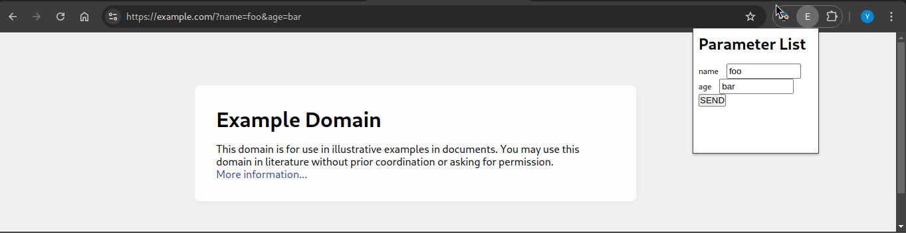

# What is easy param?

Easy param is a chrome extension that let you easily replace parameter values.



## How to install easy param?

1. First clone this repository and cd to it

```
git clone https://github.com/mellash/easy-param
cd easy-param
```
2. Then compile the typescript

```
tsc
```

3. Finally add `easy-param` directory to the chrome extension by going to `chrome://extensions/`